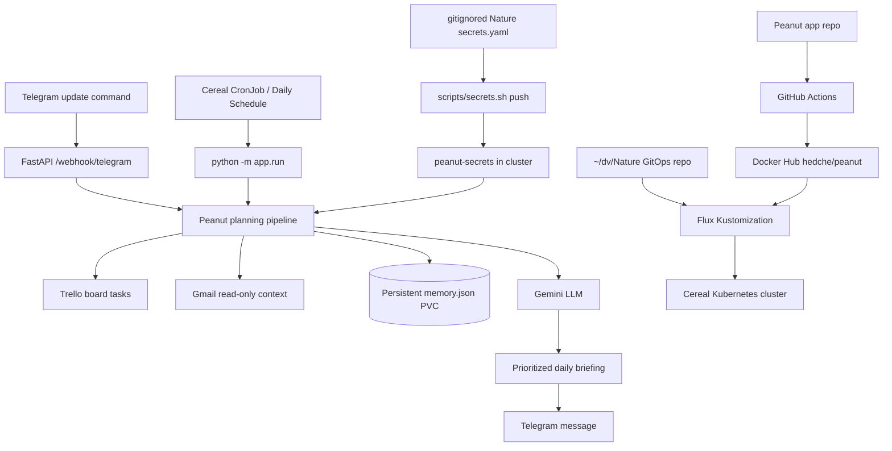

# Peanut — AI Personal Assistant

Peanut is a secure, lightweight AI personal assistant that reads Trello tasks,
adds read-only Gmail context, asks Gemini for concise prioritization, remembers
carry-over work, and sends a daily briefing to Telegram.

This repository is public. Do not commit secrets, OAuth tokens, local memory
files, kubeconfigs, plaintext Kubernetes Secrets, or personally identifiable
local paths.

## How Peanut Works



## Stack

- Python 3.12
- FastAPI + Uvicorn
- uv for dependency management
- Google Gemini Developer API via `google-genai`
- Trello REST API
- Gmail OAuth2 read-only context
- Telegram bot delivery and webhook command handling
- Docker multi-arch image publishing to `hedche/peanut`
- Flux GitOps deployment to the Cereal Kubernetes cluster

## Security Model

- Local credentials live in `.env.local`; this file is gitignored.
- Commit only `.env.example` placeholders.
- GitHub Actions uses repository secrets for Docker Hub auth:
  - `DOCKER_USERNAME`
  - `DOCKER_TOKEN`
- Cereal Kubernetes credentials are managed from the Nature GitOps repo with:
  - local path: `~/dv/Nature`
  - local plaintext file: `~/dv/Nature/secrets.yaml` (gitignored)
  - helper: `~/dv/Nature/scripts/secrets.sh`
- Never commit real `.env` files, OAuth refresh tokens, API keys, kubeconfigs,
  local memory data, or plaintext Kubernetes Secret manifests.

## Configuration

Copy the local environment file from the reference app only after confirming
`.gitignore` is present:

```bash
cp ~/dv/leafbit/ai-wedding-planner/.env.local .env.local
git status --short --ignored .env.local
```

Expected: `.env.local` is shown as ignored, not untracked.

For new environments, start from:

```bash
cp .env.example .env.local
```

Required provider variables:

- `TRELLO_API_KEY`
- `TRELLO_API_TOKEN`
- `TRELLO_BOARD_ID`
- `GOOGLE_API_KEY`
- `TELEGRAM_BOT_TOKEN`
- `TELEGRAM_CHAT_ID`

Optional Gmail context:

- `GMAIL_CLIENT_ID`
- `GMAIL_CLIENT_SECRET`
- `GMAIL_REFRESH_TOKEN`
- `GMAIL_SENDER_EMAILS`

## Local Development

```bash
uv sync
uv run uvicorn app.main:app --host 127.0.0.1 --port 8000 --reload
```

Health and metrics:

```bash
curl -fsS http://127.0.0.1:8000/health
curl -fsS http://127.0.0.1:8000/metrics
```

Run a one-shot briefing:

```bash
uv run python -m app.run
```

Note: the one-shot command sends a real Telegram briefing when credentials are
configured.

## Tests

```bash
uv run pytest
```

## Docker

```bash
docker build -t peanut:local .
docker run --rm --env-file .env.local -p 8000:8000 peanut:local
```

GitHub Actions publishes multi-architecture images to:

```text
hedche/peanut
```

## Deployment

The app repo owns application code, Docker build config, tests, and public docs.
The Cereal cluster desired state lives in the Nature GitOps repo:

```text
~/dv/Nature
```

Expected live manifest locations:

- `~/dv/Nature/kubernetes/peanut`
- `~/dv/Nature/kubernetes/flux/peanut.yaml`
- `~/dv/Nature/kubernetes/flux/kustomization.yaml`

Create/update the `peanut-secrets` Kubernetes Secret through Nature’s secret
helper, not by committing plaintext Secret YAML.

## API

- `GET /health` — health check
- `GET /metrics` — Prometheus-compatible LLM metrics
- `GET /metrics/json` — JSON metrics
- `GET /report` — generate and send today’s briefing
- `POST /webhook/telegram` — handle Telegram `update` command
